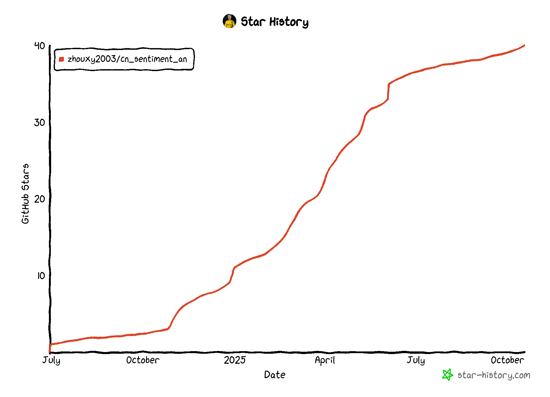

# Clasificación de sentimientos en chino basada en BERT

<p align="center">
  <a href="https://github.com/google-research/bert">
    
  </a>
    <a href="https://github.com/huggingface/transformers">
    
  </a>
</p>

Este documento presenta cómo implementar una tarea de análisis de sentimientos utilizando la biblioteca `transformers` y herramientas relacionadas. Los scripts se basan en el modelo BERT preentrenado (`bert-base-chinese`) para clasificar el texto, con las etiquetas positivo (positive), negativo (negative) y neutral (neutral).

---
- `cn_sentiment.py` es el archivo de entrenamiento
- `tag.py` es el archivo de prueba

## 1. **Dependencias del entorno**

Antes de ejecutar el código, asegúrate de tener instaladas las siguientes bibliotecas de Python:

- `transformers`
- `datasets`
- `pandas`
- `numpy`
- `seaborn`
- `matplotlib`
- `scikit-learn`
- `torch`

Puedes instalar las dependencias con el siguiente comando:

```bash
pip install transformers datasets pandas numpy seaborn matplotlib scikit-learn torch
```

---

## 2. **Flujo de trabajo del script**

### **Paso 1: Cargar y procesar los datos**
1. **Leer el archivo CSV de entrada**  
   Lee los datos usando pandas:
   ```python
   df = pd.read_csv('test.csv', encoding='gbk')
   ```
   El archivo CSV de entrada debe contener las siguientes dos columnas:
   - `text` : Contenido del texto.
   - `sentiment` : Etiqueta de sentimiento (positive, negative o neutral).

2. **Definir el mapeo de etiquetas**  
   Mapea las etiquetas de sentimiento a valores numéricos:
   ```python
   target_map = {'positive': 1, 'negative': 0, 'neutral': 2}
   df['target'] = df['sentiment'].map(target_map)
   ```

3. **Extraer texto y etiquetas**  
   Conserva solo las columnas de texto y etiqueta, y guárdalas en un nuevo archivo CSV:
   ```python
   df2 = df[['text', 'target']]
   df2.columns = ['sentence', 'label']
   df2.to_csv('data.csv', index=None)
   ```

---

### **Paso 2: Dividir el conjunto de datos**
- Carga los datos preprocesados usando la biblioteca `datasets`:
  ```python
  raw_datasets = load_dataset('csv', data_files='data.csv')
  ```

- Divide los datos en conjuntos de entrenamiento y prueba (30% para prueba):
  ```python
  split = raw_datasets['train'].train_test_split(test_size=0.3, seed=42)
  ```

---

### **Paso 3: Cargar el tokenizador**
Usa el tokenizador BERT preentrenado para tokenizar las oraciones:
```python
tokenizer = AutoTokenizer.from_pretrained('bert-base-chinese')

def tokenize_fn(batch):
    return tokenizer(batch['sentence'], truncation=True)

tokenized_datasets = split.map(tokenize_fn, batched=True)
```

---

### **Paso 4: Cargar el modelo preentrenado**
Carga el modelo `bert-base-chinese` y configura el número de etiquetas para la tarea de clasificación (3):
```python
model = AutoModelForSequenceClassification.from_pretrained('bert-base-chinese', num_labels=3)
```

---

### **Paso 5: Configurar los parámetros de entrenamiento**
Define los parámetros de entrenamiento, como el número de épocas, el tamaño del lote, etc.:
```python
training_args = TrainingArguments(
    output_dir='training_dir',  # Directorio de salida
    evaluation_strategy='epoch',  # Evaluar en cada epoch
    save_strategy='epoch',  # Guardar el modelo en cada epoch
    num_train_epochs=3,  # Número de épocas
    per_device_train_batch_size=16,  # Tamaño de lote de entrenamiento por dispositivo
    per_device_eval_batch_size=64  # Tamaño de lote de evaluación por dispositivo
)
```

---

### **Paso 6: Definir la función de evaluación de rendimiento**
Calcula la precisión (accuracy) y la puntuación F1 del modelo:
```python
def compute_metrics(logits_and_labels):
    logits, labels = logits_and_labels
    predictions = np.argmax(logits, axis=-1)
    acc = np.mean(predictions == labels)
    f1 = f1_score(labels, predictions, average='macro')
    return {'accuracy': acc, 'f1': f1}
```

---

### **Paso 7: Entrenar el modelo**
Utiliza `Trainer` para el entrenamiento y validación del modelo:
```python
trainer = Trainer(
    model,  # Instancia del modelo
    training_args,  # Parámetros de entrenamiento
    train_dataset=tokenized_datasets["train"],  # Conjunto de datos de entrenamiento
    eval_dataset=tokenized_datasets["test"],  # Conjunto de datos de validación
    tokenizer=tokenizer,  # Tokenizador
    compute_metrics=compute_metrics  # Función de evaluación
)

trainer.train()
```

---

## 3. **Estructura de archivos del script**
- `test.csv` : Archivo de datos de entrada, que contiene las columnas `text` y `sentiment`.
- `data.csv` : Archivo de datos preprocesados, que contiene las columnas `sentence` y `label`.
- `training_dir/` : Directorio de salida del entrenamiento, donde se almacenan el modelo y los registros de entrenamiento.

---

## 4. **Consideraciones**
- Asegúrate de que el formato de los datos de entrada sea correcto (por ejemplo, los nombres de las columnas y la codificación del archivo CSV).
- Ajusta los parámetros de entrenamiento según los requisitos de la tarea (como las épocas y el tamaño del lote).
- El modelo generado puede utilizarse para tareas de inferencia posteriores.

---

## Gracias a todos por su apoyo. Construyamos juntos el mundo del código abierto

## Gracias a todos por su apoyo. Trabajemos juntos para contribuir al mundo del código abierto.


